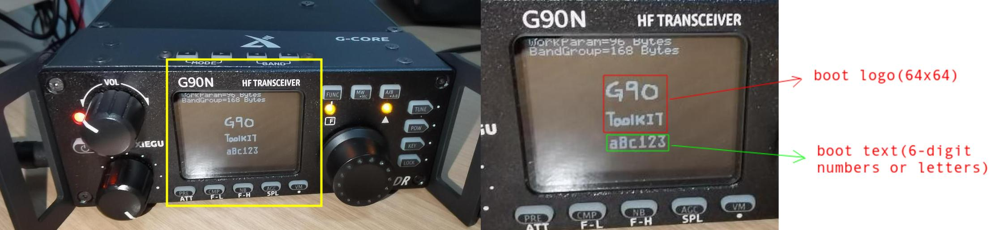
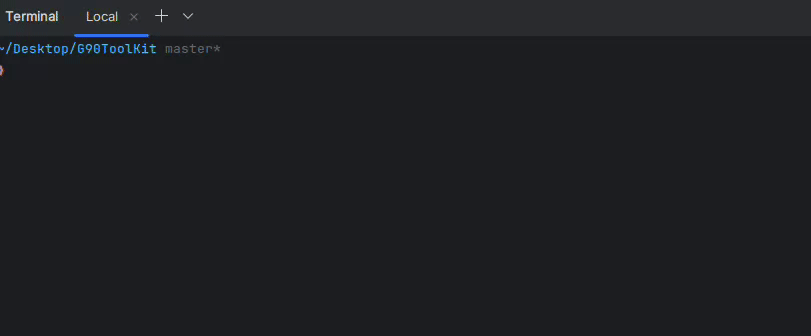

# G90ToolKit

## Introduction

This software is based on several open-source tools, allowing users to:

+ Modify the embedded boot image/text in the G90 firmware.
+ Encrypt/Decrypt firmware use user provided key
+ Take a brief look at the firmware info
+ Flash firmware into G90 series Rigs (g90updatefw integrated)
+ ......

This software should work on windows/linux/macos but I only tried it on ubuntu 24.04

> [!important]  
> The official Xiegu firmware is encrypted using the AES-256 algorithm, making it nearly impossible to decrypt without
> the key. Fortunately, there are open-source methods available to extract the
> encryption key using an ST-LINK debugger and OpenOCD tools. Due to copyright restrictions, I cannot provide the key
> here, but you can extract the encryption key and decrypt the firmware using the methods outlined
> in [G90Tools](https://github.com/OpenHamradioFirmware/G90Tools) or by finding the key shared by others online.

## Usage

+ `./g90toolkit -i` Enter interactive mode. Follow the instructions to provide the relevant information. The software will automatically decrypt the firmware, replace images and text, re-encrypt the firmware, and flash it into the device.

  

+ `./g90toolkit decrypt --firmware <encrypted_firmware> --output <path_to_save_decrypted_firmware> --key <your_key>` Decrypt firmware using specified key.

+ `./g90toolkit encrypt --firmware <decrypted_firmware> --output <path_to_save_encrypted_firmware>  --key <your_key>` Encrypt firmware using specified key.

+ `./g90toolkit getinfo --firmware <firmware>` Read information of the firmware.

+ `./g90toolkit flashfw --firmware <encrypted_firmware> --device <serial_port>` write a firmware file to a Xiegu radio.

+ `./g90toolkit patchimg --firmware <decrypted_firmware> --logo-path <logo_to_apply_to_the_firmware> --output  <path_to_save_patched_firmware> `  Patch boot logo

+ `./g90toolkit patchtext --firmware <decrypted_firmware> --text <text_to_apply_to_the_firmware> --output  <path_to_save_patched_firmware> `  Patch boot text

+ use `./g90toolkit <command> --help` to get help information.

## Many thanks to ...

- [G90Tools](https://github.com/OpenHamradioFirmware/G90Tools) (kbeckmann, GitHub) *Tools and guides for analyzing Xiegu
  G90 firmware*
- [Bootloader extraction procedure from Xiegu G90 processors](https://radiochief.ru/radio/protsedura-izvlecheniya-bootloader-iz-xiegu-g90/) (
  Denis Dubov, Radiochief.ru magazine 06/2022) *Dumping firmware and bootloaders*
- [BBFW](https://github.com/fventuri/BBFW) (Franco Venturi, GitHub) *BBFW utilities and tools*
- [g90updatefw](https://github.com/DaleFarnsworth/g90updatefw) (Dale Farnsworth, GitHub)  *Xiegu G90 and Xiego G106
  Firmware Updater*

## Disclaimer

- No warranty is provided. Any damage caused by using this tool is your own responsibility.
- The purpose of this tool is to help users modify the startup screen more conveniently, rather than to harm Xiegu's
  interests.